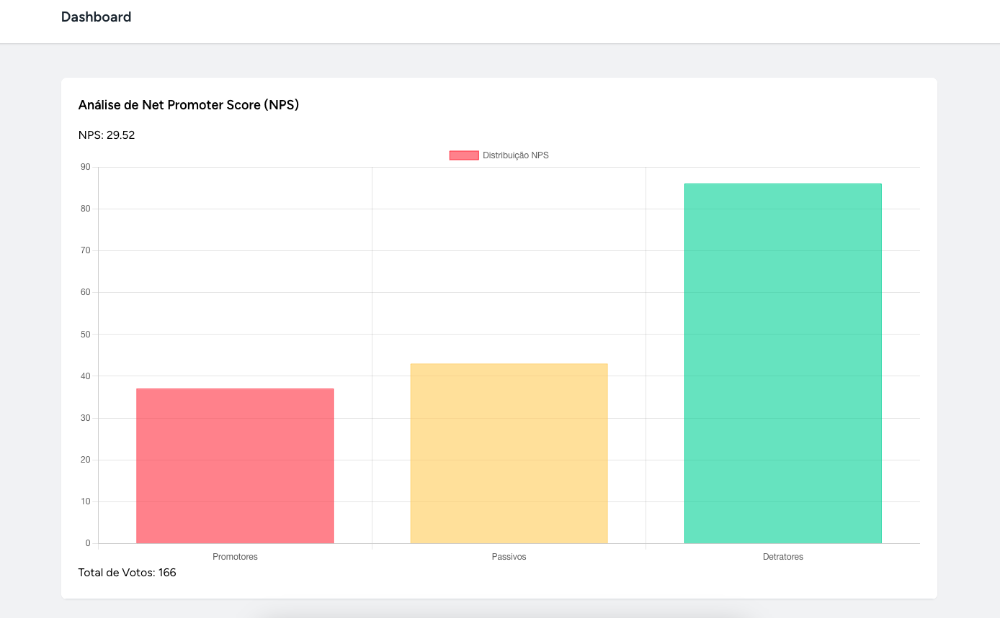

# NPS

Este projeto é uma implementação do Net Promoter Score (NPS), um indicador-chave de desempenho muito importante para as empresas. Comumente encontrado em totens para avaliar a experiência do cliente, esta implementação oferece uma solução acessível e gratuita para uso.

## Tecnologias utilizadas


## Sobre


O NPS é uma métrica utilizada para medir a satisfação e lealdade dos clientes em relação a uma empresa. Ele é calculado com base nas respostas dos clientes a uma única pergunta: "Em uma escala de 0 a 10, o quanto você recomendaria nossa empresa/produto/serviço a um amigo ou colega?". Com base nas respostas, os clientes são classificados em três categorias: Promotores (notas 9-10), Passivos (notas 7-8) e Detratores (notas 0-6).


Este projeto permite que as empresas coletem avaliações do NPS de seus clientes e visualizem os resultados em um painel de controle intuitivo. Ele inclui uma implementação completa de backend em Laravel, que utiliza SQLite como banco de dados, e frontend em React para criar uma experiência de usuário agradável e responsiva.




## Features

- Dashboard
- Tela para coleta de dados

## Instalação


```bash
# Clone o reposiótiro
git clone https://github.com/mcoldibelli/nps

# Entre no diretório do projeto
cd nps

# Instale as dependências
npm install
```

# Uso
Inicie o backend e frontend

```bash
npm run dev
php artisan serve
```
1. Entre em http://127.0.0.1:8000/
2. Clica em Register para criar uma conta
3. Estando logado, na aba superior clique em NPS
4. Os dados poderão ser visto na aba Dashboard
